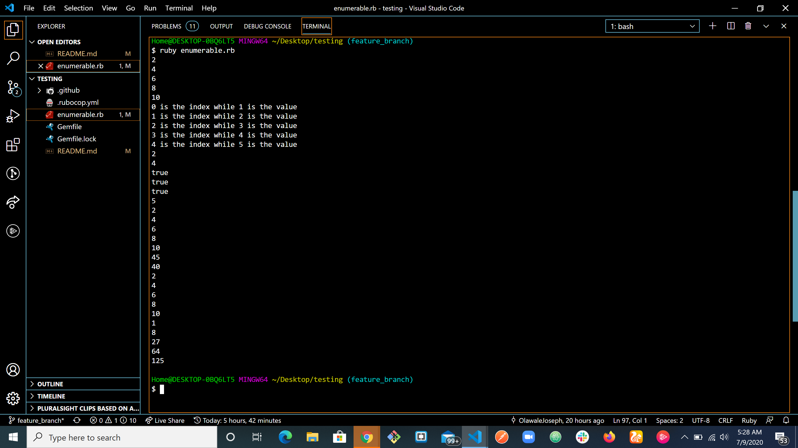

# Project Name

Implementation of Ruby’s enumerable methods.
This project was built to further solidify our knowledge of Ruby. It helps to understand how the common funtions used in the Ruby, functions internally.
The project invovled the use of #loop, #yield, #call, #conditionals to build upon ruby built-in enumerable method.

## Built With

- Ruby,

## Getting Started

To get a local copy of the repository please run the following commands on your terminal:

- git clone https://github.com/somoye123/Enumerables-Ruby.git
- cd into above cloned directory
- run ruby enumerable.rb
- Uncomment test code at the bottom of the page or add your preferred test code and repeaat previous step

## Authors

👤 **Somoye**

- Github:[@somoye123](https://github.com/somoye123)
- Twitter:[@ayotunde_197](https://twitter.com/ayotunde_197)
- LinkedIn:[Somoye Ayotunde](https://www.linkedin.com/in/somoye-ayotunde-03a471161)

👤 **Olawale**

- Github:[@OlawaleJoseph](https://github.com/OlawaleJoseph)
- Twitter:[@javanode123](https://twitter.com/javanode123)
- LinkedIn:[olawale-adedeko](www.linkedin.com/in/olawale-adedeko)

## 🤝 Contributing

Contributions, issues and feature requests are welcome!

Feel free to check the [issues page](https://github.com/somoye123/Enumerables-Ruby/issues).

## Show your support

Give a ⭐️ if you like this project!

## 📝 License

This project is [MIT](lic.url) licensed.
